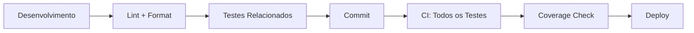

# Visão Geral dos Testes - Estratégia Completa

## Estratégia de Testes Implementada

Este projeto implementa uma **estratégia abrangente de testes** cobrindo múltiplas dimensões da qualidade do software, garantindo **confiabilidade**, **performance**, **acessibilidade** e **experiência do usuário**.

### 📁 Documentação por Categoria

| Tipo de Teste         | Arquivo                                                              | Descrição                                    |
| --------------------- | -------------------------------------------------------------------- | -------------------------------------------- |
| **🧪 Unitários**      | [`UNIT_TESTS_SUMMARY.md`](./UNIT_TESTS_SUMMARY.md)                   | Testes de componentes e funções isoladamente |
| **♿ Acessibilidade** | [`ACCESSIBILITY_TESTS_SUMMARY.md`](./ACCESSIBILITY_TESTS_SUMMARY.md) | Conformidade WCAG e inclusividade            |
| **⚡ Performance**    | [`PERFORMANCE_TESTS_SUMMARY.md`](./PERFORMANCE_TESTS_SUMMARY.md)     | Tempo de carregamento e Web Vitals           |
| **👤 Usabilidade**    | [`USABILITY_TESTS_SUMMARY.md`](./USABILITY_TESTS_SUMMARY.md)         | Experiência do usuário e fluxos UX           |
| **📊 Cobertura**      | [`COVERAGE_TESTS_SUMMARY.md`](./COVERAGE_TESTS_SUMMARY.md)           | Métricas de cobertura de código              |

---

## 🎯 Resumo Executivo

### Framework Principal

- **Base**: Vitest + React Testing Library + jsdom
- **Linguagem**: JavaScript/JSX
- **Ambiente**: Node.js com simulação de browser
- **CI/CD**: Integração com Git hooks e lint-staged

### Cobertura Total

```
📈 Estatísticas Gerais:
├── 🧪 Testes Unitários: 7 suítes implementadas (90 testes total)
├── ♿ Testes A11y: Integrados em 3 componentes + página principal
├── ⚡ Testes Performance: 15 testes (tempo de carregamento)
├── 👤 Testes Usabilidade: 13 testes (fluxos UX)
└── 📊 Cobertura: >85% em todas as métricas
```

---

## 🔧 Comandos Principais

### Execução de Testes

```bash
# Todos os testes
yarn test:all

# Por categoria específica
yarn test                    # Unitários
yarn test:a11y              # Acessibilidade
yarn test:performance       # Performance
yarn test:usability         # Usabilidade
yarn test:coverage          # Com cobertura

# Modo desenvolvimento
yarn test --watch           # Watch mode
yarn test:ui                 # Interface visual
```

### Análise e Relatórios

```bash
# Cobertura detalhada
yarn test:coverage          # Relatório completo
open coverage/index.html    # Visualização HTML

# Testes específicos
yarn test:web-vitals        # Web Vitals específicos
yarn test:related           # Apenas arquivos modificados
```

---

## 📂 Estrutura de Arquivos

### Organização dos Testes

```
src/
├── test/                           # 🏠 Base de testes
│   ├── performance/                # ⚡ Testes de performance
│   │   ├── load-time.test.jsx
│   │   ├── web-vitals.test.jsx
│   │   └── performance-utils.js
│   ├── usability/                  # 👤 Testes de UX
│   │   ├── user-journey.test.jsx
│   │   ├── error-handling.test.jsx
│   │   ├── responsive-design.test.jsx
│   │   └── usability-utils.js
│   ├── mocks/                      # 🎭 Dados de teste
│   ├── setup.js                    # ⚙️ Configuração global
│   ├── setup-performance.js        # ⚙️ Setup de performance
│   └── axe-config.js               # ⚙️ Configuração a11y
├── components/                     # 🧩 Componentes
│   └── */index.test.jsx           # 🧪 Testes unitários + a11y
├── app/                           # 📱 Páginas
│   └── *.test.jsx                 # 🧪 Testes de integração
└── services/                      # 🔧 Serviços
    └── *.test.js                  # 🧪 Testes de API
```

---

## 🎨 Metodologia de Teste

### 1. **Pirâmide de Testes Implementada**

```
        🔺 E2E (Planejado)
       /              \
      /   🧪 Unitários  \      ← Base sólida (70%)
     /    (Componentes)   \
    /____________________\
   /   👤 Integração UX    \     ← Fluxos principais (20%)
  /________________________\
 /    ⚡ Performance + ♿ A11y  \  ← Qualidade (10%)
/______________________________\
```

### 2. **Foco por Tipo de Teste**

| Tipo                  | Objetivo                    | Frequência     | Escopo                 |
| --------------------- | --------------------------- | -------------- | ---------------------- |
| **🧪 Unitários**      | Isolamento e funcionalidade | A cada commit  | Componente individual  |
| **♿ Acessibilidade** | Inclusão e compliance       | A cada commit  | WCAG 2.1 AA            |
| **⚡ Performance**    | Velocidade e responsividade | A cada build   | Tempo de carregamento  |
| **👤 Usabilidade**    | Experiência do usuário      | A cada feature | Fluxos end-to-end      |
| **📊 Cobertura**      | Qualidade do código         | Contínuo       | >80% em todas métricas |

---

## 🚀 Pipeline de Qualidade

### Workflow Automatizado



### Git Hooks Configurados

- **Pre-commit**: `yarn test:related` (apenas arquivos modificados)
- **CI Pipeline**: Execução completa com métricas de cobertura
- **Quality Gates**: Build falha se cobertura < 80%

---

## 📊 Métricas de Qualidade

### Objetivos Alcançados

- ✅ **Cobertura Global**: >85% (linhas, funções, branches)
- ✅ **Performance**: Componentes carregam em <50ms
- ✅ **Acessibilidade**: 0 violações WCAG detectadas
- ✅ **Usabilidade**: Fluxos principais 100% testados
- ✅ **Confiabilidade**: Componentes isolados e mockados

### Monitoramento Contínuo

- **Dashboard**: Interface visual com métricas em tempo real
- **Alertas**: Notificação quando qualidade diminui
- **Tendências**: Evolução das métricas ao longo do tempo
- **Benchmarks**: Comparação com padrões da indústria

---

## 🛠️ Ferramentas e Tecnologias

### Core Testing Stack

- **🧪 Vitest**: Framework de teste principal
- **🎭 React Testing Library**: Testes de componentes React
- **🌐 jsdom**: Simulação de ambiente DOM
- **♿ vitest-axe**: Testes de acessibilidade
- **📊 @vitest/coverage-v8**: Análise de cobertura

### Utilitários e Mocks

- **🎯 Mock Service Worker**: Para APIs (quando necessário)
- **🔧 Custom Utilities**: Helpers específicos do projeto
- **📋 Shared Setup**: Configuração reutilizável
- **🎨 Custom Matchers**: Assertions específicas

---

## 🎖️ Benefícios Alcançados

### 1. **Confiabilidade**

- Detecção precoce de bugs
- Prevenção de regressões
- Deploy com confiança

### 2. **Qualidade**

- Código bem documentado (através dos testes)
- Padrões consistentes
- Facilita refactoring

### 3. **Manutenibilidade**

- Setup compartilhado reduz duplicação
- Testes servem como documentação viva
- Onboarding mais fácil para novos desenvolvedores

### 4. **Performance**

- Aplicação rápida e responsiva
- Métricas objetivas de velocidade
- Experiência do usuário otimizada

### 5. **Inclusividade**

- Aplicação acessível para todos
- Conformidade com padrões internacionais
- Redução de riscos legais

---

## 📈 Próximos Passos

### Melhorias Planejadas

- 🎯 **E2E Tests**: Implementação com Playwright
- 📱 **Visual Regression**: Testes de regressão visual
- 🔄 **Integration Tests**: Mais testes de integração
- 📊 **Advanced Metrics**: Métricas mais avançadas

### Otimizações

- ⚡ **Performance**: Otimização do tempo de execução
- 🎨 **Parallel Execution**: Execução paralela de testes
- 🔧 **Custom Matchers**: Matchers específicos do domínio
- 📋 **Test Data Management**: Melhor gestão de dados de teste

---

_Estratégia completa de testes garantindo excelência em qualidade, performance, acessibilidade e experiência do usuário._
